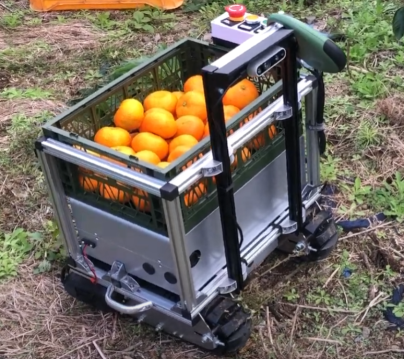
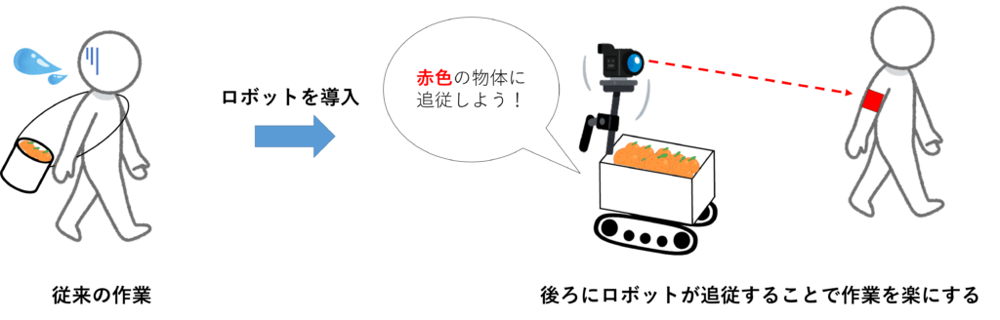
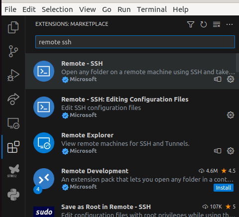
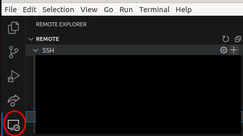
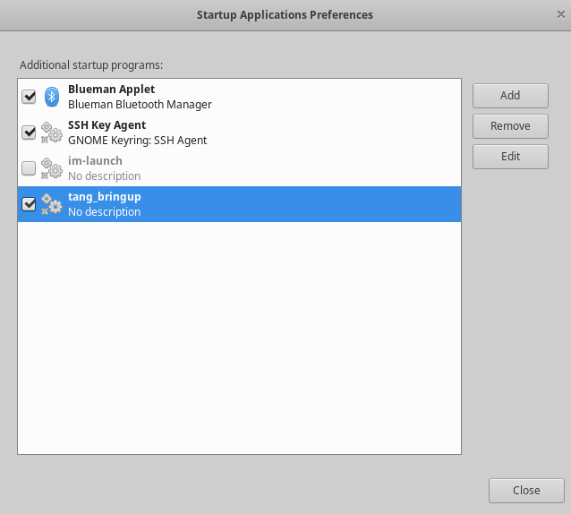

# 収穫サポートロボット「TANG」
[CuGo V3](https://cuborex.com/cugo)を使った収穫サポートロボットTANG  
  

開発背景などの詳細はロボゼミでの[発表スライド](https://docs.google.com/presentation/d/1ee6lWTKakHZedKpi5SkKf4kFQXAP9l1Z/edit#slide=id.p1)をご確認ください  

  

## 使用した主な部品
- 足回り
  - [CuGo V3](https://cuborex.com/cugo)
- カメラ
  - [Webカメラ](https://amzn.asia/d/0IFd8t9)
    - スペック
      - 視野角 150°
      - 200万画素
- 制御PC
  - [Raspberry Pi 4](https://www.raspberrypi.com/products/raspberry-pi-4-model-b/) 
    - OS
      - Xbuntu 20.04
    - Framework
      - ROS 1, noetic
- モータドライバ
  - [Cytron SmartDriveDuo 10A](https://www.cytron.io/p-10amp-5v-30v-dc-motor-driver-2-channels)
- 電源
  - モータ駆動用電源 24V
    - [完全密封型鉛蓄電池　12V5Ah](https://akizukidenshi.com/catalog/g/gB-00940/)
  - 制御PC RaspberryPi用電源 5V, 3A出力
    - [Anker PowerCore 10000 PD Redux 25W](https://www.ankerjapan.com/products/a1246)
- 遠隔操作用Joystick
  - [Logicool F710 Wireless Gamepad](https://gaming.logicool.co.jp/ja-jp/products/gamepads/f710-wireless-gamepad.940-000144.html)

## SetUp
### 【制御PC】Raspberry Pi 4
#### Install Ubuntu
Ubuntuが入ったPCで[rpi_xubntu_ros](https://github.com/Ar-Ray-code/rpi_xubuntu_ros)を参照しながら、Xubuntu + ROSの[イメージファイル](https://github.com/Ar-Ray-code/rpi_xubuntu_ros/releases/tag/20.04_v1.0)をダウンロードした後、[Raspberry Pi Imager](https://www.raspberrypi.com/software/)を使って書き込む  

#### Install ROS
```bash
$ sudo sh -c 'echo "deb http://packages.ros.org/ros/ubuntu $(lsb_release -sc) main" > /etc/apt/sources.list.d/ros-latest.list'
$ sudo apt -y install curl 
$ curl -s https://raw.githubusercontent.com/ros/rosdistro/master/ros.asc | sudo apt-key add -
# install ROS
$ sudo apt update
$ sudo apt -y install ros-noetic-desktop-full
# パス設定
$ echo "source /opt/ros/noetic/setup.bash" >> ~/.bashrc
$ source ~/.bashrc
$ source /opt/ros/noetic/setup.bash
# rosdep
$ sudo apt -y install python-rosdep python-rosinstall python-rosinstall-generator python-wstool build-essential
$ sudo rosdep init
$ rosdep update
# catkin pkg
$ pip3 install rospkg catkin_pkg
```

#### Install Pip
必要なPythonのライブラリをインストールするために必要なライブラリです。
```bash
$ sudo apt install python3-pip  
```

#### Install OpenCV
OpenCVは画像処理機能をまとめたオープンソースのライブラリです。
今回の場合は、カメラ画像を取得したり、得られた画像をもとに画像処理を行い、色検出を行うために使用します。
```bash
$ sudo apt update 
$ pip3 install opencv-python
$ pip3 install opencv-contrib-python
```

#### Install pigpio
Raspberry PiのGPIOピンを操作するときに使用します。例えば、PWM制御やスイッチの入出力などに使用します。
```bash
$ sudo apt update
$ sudo apt install build-essential
$ git clone https://github.com/joan2937/pigpio
$ cd pigpio
$ make
$ sudo make install
# pigpio daemonを起動する
$ sudo pigpiod
```

#### Install Joy  
TANGを遠隔操作するときに使用するJoystickをROSで動作させるためのパッケージをインストールします。
```bash
$ sudo apt-get install ros-noetic-joy
```
### 【開発用PC】UbuntuがインストールされたPC
#### Install VSCode
[公式ページ](https://code.visualstudio.com/docs/setup/linux)を参考にしてください。  
#### Install Remote SSH
VSCodeの拡張機能で"Remote SSH"を検索し、インストール  
  
インストール後は、VSCodeを再起動し、下記画像の赤枠に示されたアイコンをクリックする  
  
sshはubuntu@"IPアドレス"を入力し、その後パスワードも入力する  
IPアドレスは制御PCであるRaspberry PiのIPアドレスを調べて入力する  

## パッケージ構成
```
├── ./doc ## READMEに記載する画像など
├── ./tang_bringup # ロボットを起動するためのパッケージ  
│   └── ./tang_bringup/launch
├── ./tang_control # ロボット制御用のパッケージ
│   └── ./tang_control/scripts
│       └── ./tang_control/scripts/mymodule
├── ./tang_detection # 色検出用のパッケージ
│   ├── ./tang_detection/launch
│   └── ./tang_detection/scripts
├── ./tang_msgs # ロボットの通信用のパッケージ
│   └── ./tang_msgs/msg
├── ./tang_teleop # ロボットの遠隔操作用パッケージ  
│   ├── ./tang_teleop/launch
│   └── ./tang_teleop/scripts
└── ./test ## エンコーダ値の取得や速度制御のテスト用スクリプト
```
### tang_bringup
ロボットを起動するためのパッケージ  
tang_detectionとtang_control 2つのパッケージを同時に起動する。  
### tang_control
ロボット制御用のパッケージ  
色検出結果をもとに対象に追従する。また、モード切替をすることで、joystickを使ってロボットの遠隔操作も行う。  
##### パラメータ調整（ゲイン調整、速度設定）
/tang_control/config.pyでパラメータ調整が可能です。  
PID制御のゲイン調整
```bash
# 人追従時のPID
class FOLLOWPID:
    p_gain = 0.002
    d_gain = 0.0
    #d_gain = 7.0
    dt = 0.01

# 速度制御時のPID
class PID:
    Kp = 1.0
    Ki = 0.01
    Kd = 0.00
```
最大速度、最大角速度、目標加速度、目標減速加速度の設定を行います。

```bash
# 最大角速度
max_w = 0.5
# 最大速度
max_velocity = 0.2
# 目標加速度
a_target = 0.01
# 目標減速加速度
d_target = -0.01
``` 
また、対象物の大きさに応じて、速度を変更しています。
min_area_threshを小さくすれば、対象物が遠くても追従する一方で、対象物と同じ色をした他の対象物に追従する場合があります。
min_area_threshを大きくすれば、同じ色をした他の対象物に追従しなくなりますが、対象者が遠いと追従しない場合があります。
max_area_threshは、対象者とロボットとの距離をどれくらい保つかのパラメータです。
大きければ大きいほど、対象者の近くで停止します。小さいと、対象者と離れた位置で停止します。
```python
class HumanFollowParam:
    # 対象物が小さい場合は追従しないためのパラメータ
    min_area_thresh = 70
    # 対象物の大きさに応じて速度を変更するためのパラーメタ
    max_area_thresh = 250
```
### tang_detection
色検出用のパッケージ  
カメラから取得した画像をもとに、予め設定された色を検出し、tang_controlノードに検出結果を送る。  
##### パラメータ調整（色検出の閾値設定）
tang_detection/scripts/config.py内のhsvの値を変更することで設定します。 
```python
class ColorObjectParam:
    # 色相
    hue_min = 40
    hue_max = 80
    # 彩度
    sat_min = 0
    sat_max = 127
    # 明度
    val_min = 0
    val_max = 255
    # 追跡対象としてみなす領域の最小値
    object_min_area = 100
```
### tang_msgs
tang_control, tang_detection, tang_teleopそれぞれのパッケージで実行されたノード同士が通信するために必要なメッセージの定義
### tang_teleop
ロボットの遠隔操作用パッケージ  
Joystickから受信した信号をもとに、ロボットを遠隔操作する。  
##### パラメータ調整（遠隔操作時の速度設定）
JoystickのAボタンを押すと速度が上がり、Bボタンを押すと速度が下がります。  
また、JoystickのBackボタンを押すと遠隔操作と人追従のモードを切り替えられます。
## 実行方法
#### 色検出＋ロボットを起動する
色検出を行い、ロボットが対象を追従します。
```bash
$ roslaunch tang_bringup tang_bringup.launch
```
Remote SSHを使って、外部PCから上記のコマンドを実行する場合は、下記のコマンドを実行してから、上記のコマンドを実行してください。  
こうすることで、色検出結果がRaspberry Piに接続されたディスプレイに表示されます。  
```bash
$ export DISPLAY=:0
```
#### 色検出のみを起動する場合
ロボットを動作させずに、色検出のみを実行したい場合は、下記の通りに実行してください。主に、色検出時の色の閾値の調整時に実行します。
```bash
$ roslaunch tang_detection tang_detection.launch
```

## 自動起動方法
自動起動は、制御ボックス内のスイッチボタンを押すことで自動でROSノードが起動するように設定されています。  
自動起動用のシェルスクリプトは、
```bash
~/ros1_ws/src/tang/.shellscripts/bringup_raspi.sh
```
に書かれています。このシェルスクリプトを制御PC Raspberry Piが起動時に実行するように登録します。  
登録方法は、まずUbuntu Dockで"Startup"と検索し、表示された"Startup Application"を起動します。起動後に、下記画像の"tang_bringup"を選択し、自動起動するスクリプトでbringuup_raspi.shを選択することで、登録することができます。  
  
## ライセンス
[Apache License, Version 2.0](https://www.apache.org/licenses/LICENSE-2.0)
